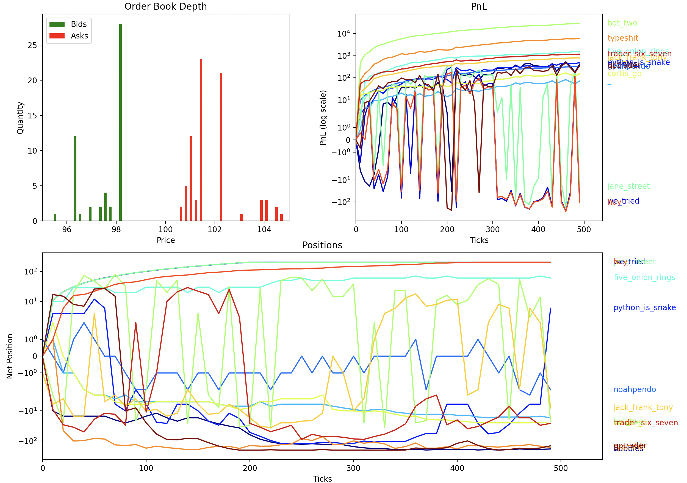
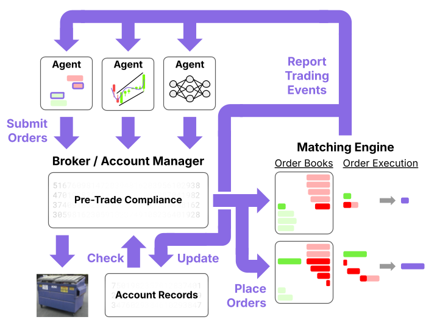

# Mini-Stocks, Fall 2025

This was an experimental project that implemented a stock exchange simulation from scratch and used it to host educational trading competitions.



## Structure

**Note:** This section is a modification of text that was originally in the project documentation.

### Overview

The simulation design can be briefly summarized with the following diagram



There are 4 core functional components:

* **Trading Agents:** Processes market data and submits order requests

* **Broker:** Tracks the account states (cash, position) of each agent and validates order requests

* **Matching Engine:** Manages the order books and executes orders

* **Simulation**

**NOTE:** Due to time constraints, a limited version of this design that uses exactly one order book is implemented.

### Trading Agents

Trading agents are the most flexible component of the market.

There are, however, a few properties of trading agents that this project enforces:

* Uniqueness

* Can access information about every resting order

* Can access information about its own account state

* Can request any number of any type of order

Enforcement of these properties is through the abstract base class `TradingAgent` in `agents/base_agent.py`.

This project requires that the implementation of every trading agent is its own class that [extends](https://www.w3schools.com/python/python_inheritance.asp) the `TradingAgent` class, forcing the inheritence of the interface that guarantees the above properties.

User-defined `TradingAgent`s are intended to be located in the `user_agents` directory, though this is neither required nor enforced.

As an example, we can implement the trivial trading agent that never places orders:

```py
# user_agents/trivial_agent.py
from agents.base_agent import TradingAgent

class TrivialAgent(TradingAgent):
    def propose_trades(self, market_data, my_account_state):
        return []
```

Despite the very simple implementation, the `TrivialAgent` is completely functional:

```py
# Other imports are hidden
from core.types import AgentId
from user_agents import TrivialAgent

market_data = ... # Assume a valid MarketData object
account_state = ... # Assume a valid AccountState object

my_agent = TrivialAgent(AgentId(1))

# This correctly gets my_agent's OrderRequests
order_requests = my_agent.propose_trades(
    market_data,
    account_state
)
```

### Broker

The broker is the only line of defense between an illegal or impossible order request and the market.

**NOTE:** In real markets, brokers have a much broader set of responsibilities, but we believed implementing these complexities wouldn't provide additional value, so this project's broker has very limited function.

The broker is entirely implemented in `core/broker.py`, which contains the main `Broker` class, supporting dataclasses (`AccountState` and `RiskViolation`), and the `RiskViolationType` enum.

The broker enforces the following constraints on every `OrderRequest` submitted by a `TradingAgent`:

* Orders may not exceed a predetermined size

* Orders may not allow the possibility of a `TradingAgent` trading with itself

* Bids may not cost more to execute than the `TradingAgent`'s available cash

* Orders may not allow the possibility a `TradingAgent` accumulating a position greater than `n` or less than `-n` for some predetermined quantity `n`

When the `Broker` detects a violation of any of these constraints, it produces a `RiskViolation` object that is passed to the market and is made available to the user.

A side effect of enforcing the position limits constraint is careful tracking of each `TradingAgent`'s cash and position, which is itself a productive task.
As a result, the `Broker` is also the internal recordkeeper for all `AccountState`s.

Users designing and implementing `TradingAgent`s should be able to do so without knowledge of the specific implementation of `Broker`, though it is very helpful to know which constraints it enforces.

### Matching Engine

The matching engine maintains an ordered record of all `Orders` in an implementation of a limit order book and matches orders accoring to price-time priority. In order to enforce the validity of the order book at any given time, the only way to read data from or update the book is through the `MatchingEngine`.

The `MatchingEngine` implements a few key functions:

- `get_market_data` returns a `MarketData` dataclass containing a read-only copy of the entire order book

- `prune_book` removes all orders older than some configurable pruning age determined before the simulation starts

- `process_order` takes a *valid* `OrderRequest`, places a corresponding `Order` on the market, and returns the resulting `Order` *after* matching is complete. The only field that may change between an `OrderRequest` and the returned `Order` is the quantity, which may be either unchanged or less than the original quantity if the `Order` was partially or completely executed.

### Runner

The `Runner` connects `TradingAgent`s, the `Broker`, and the `MatchingEngine`. Every trading tick, the `Runner` does the following:

- Query every `TradingAgent` for `OrderRequests`, discarding potentially malicious requests (ex. invalid/incorrectly matched `AgentID`s)

- Use the `Broker` to individually validate every `OrderRequest`

- Process the `OrderRequest`s with the `MatchingEngine`

- Update the `Broker`'s account records with new trade information

- Prune the order book in `MatchingEngine`

One of the core challenges of this project was ensuring the expected performance of a `TradingAgent` doesn't depend on non-market factors like time of submission (as long as it's before weekly deadlines) and the inconsistent compute performance of the competition device. To resolve this, the `Runner` randomly shuffles the order in which it queries `TradingAgent`s every tick and always waits for each `TradingAgent` to finish computing its `OrderRequest`s before processing. Technically, this method incentivises the creation of extremely slow and complex but accurate models. Fortunately, we didn't have this issue because the market conditions were always simple enough that an well-implemented near-optimal `TradingAgent` runs fairly quickly.

## Leaderboard Mechanics

After spending a few weeks on fundamentals and the specific interfaces provided by this project, we ran optional weekly competitions for all interested members to test their `TradingAgent`s against their peers.

The weekly competitions ran in two categories: combined and individual.

The combined category consisted of exactly one simulation with every member-submitted `TradingAgent` as well as a carefully designed set of "house bots" (`TradingAgent`s that provide liquidity and enforce market conditions favorable to the class of algorithm we explored during the week).

The individual category consisted of one simulation per member-submitted `TradingAgent` with the same house bots as in the combined category. This is roughly equivalent to a carefully designed backtest done in good faith (no tampering with the house bots to degrade their performance).

The purpose of including both categories was to emphasize the magnitude of slippage that can occur when `TradingAgent`s overfit or when other market participants don't behave as you expect. While the combined leaderboard was typically the primary focus, unexpected market events like market manipulators overpowering the house bots make the individual category a more relevant measurement of the quality of each `TradingAgent`'s implementation of the intended strategy.

All [leaderboards](https://jeffreylu.me/F25-Mini-Stocks-Collector/lb.html) are published.

## Schedule

| **Week** | **Slides** | **Possibly Helpful Links** |
| --- | --- | --- |
| 1 | [Slides](https://docs.google.com/presentation/d/1HSSzH2-Ufh5kkEwkgSWHgj7pwASMvR1moZHCOuUJHrI/edit?usp=sharing) | [More on Orders & Order Books](https://optiver.com/explainers/orders-and-the-order-book/), [More on Markets](https://optiver.com/explainers/how-todays-stock-markets-work/) |
| 2 | [Slides](https://docs.google.com/presentation/d/1iQEGbS9_VWsT1r3T91QMxpnYoqTcMY2HyWwkTVj0jI4/edit?usp=sharing) | [Why Safety is not Always First](https://www.snoyman.com/blog/type-safety-doesnt-matter/), [OOP in Python](https://realpython.com/python3-object-oriented-programming/) |
| 3 | [Slides](https://docs.google.com/presentation/d/14WVJKXcfb_qP2zsm9I5DhivESNt_07FrniMfNoCEUXU/edit?usp=sharing) | [What is a Market Making](https://www.citadelsecurities.com/what-we-do/what-is-a-market-maker/) |
| - |  | Fall Break |
| 4 | [Slides](https://docs.google.com/presentation/d/1Q0EdQm0_Q2r2YpPqFR5g2a4N-dAUEXjgyY7Lrq-n3CQ/edit?usp=sharing) | [Monte Carlo Simulations](https://en.wikipedia.org/wiki/Monte_Carlo_method), [Sample Analysis](https://gist.github.com/USSiamaboat/e1e6ba7b44cb79f6ab735471dcd185c5) |
| 5 | [Slides](https://docs.google.com/presentation/d/1I45ejoqOfYXTKbjSe2IdpA-0wmXOFAh4Kao7zOR0YA8/edit?usp=sharing) | |
| 6 | [Slides](https://docs.google.com/presentation/d/1uiSOtSfsdHaxpQIbFDmxPb9J7ShtOFK8ryt4QZOs3bk/edit?slide=id.g39f70d37dfa_0_1) | [Flash Crash Report](https://www.sec.gov/news/studies/2010/marketevents-report.pdf) |
| 7 | [Slides](https://docs.google.com/presentation/d/1_A6JGydEyvU1MXTbLRzHV0UnzxlpehQ5p-wUEHYmg6w/edit?usp=sharing) | [Overfitting/Underfitting](https://www.ibm.com/think/topics/overfitting-vs-underfitting), [Look-Ahead Bias](https://corporatefinanceinstitute.com/resources/career-map/sell-side/capital-markets/look-ahead-bias/) |
| 8 | [Slides](https://docs.google.com/presentation/d/1dm76BlEoi3wiyjsIJ0BrO9HGyeIytdeKL9gcFqCRdQM/edit?usp=sharing) | [Trend-following](https://www.grahamcapital.com/blog/trend-following-primer/), [Blog Against Regime Switching](https://www.quantconnect.com/forum/discussion/14818/rage-against-the-regimes-the-illusion-of-market-specific-strategies/) |

## Other Resources

Check the "This Week in Mini-Stocks" email for updated logistics information, helpful links, and other annoucements.

Contact us via Slack or email if you have other questions:

Jeffrey Lu - `lujeff [at] umich [dot] edu`
<br>
Anish Nandamuri - `anishn [at] umich [dot] edu`
